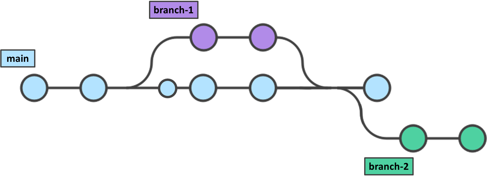

# Github-Tutorial
*Eine Einführung in Github - mit einem Schuss Website-Design*
Dieses Tutorial richtet sich an Mitarbeitende und Partner:innen des bologna.labs, die noch keine Erfahrung mit Github haben. Hoffentlich ist es in Ordnung, wenn wir uns für die Zwecke des Tutorials duzen!

In diesem Tutorial lernst du:
* was Github ist, was viele relevante Begriffe wie "Repository" und "Commit" heißen sowie einen Überblick, was man mithilfe von Github machen kann
* wie du mithilfe von Github und einen Quellcode-Editor ein Repository erstellen und bearbeiten kannst
* wie du kollaborativ an einem Repository arbeiten kannst
* wie du mithilfe von *Github Pages* eine öffentliche Webseite mit HTML erstellen und die Texte darin bearbeiten kannst.
* Im Live-Workshop erhälst du auch in Sneak-Preview, wie du mit CSS und HTML weitere Änderungen zur Struktur deiner Webseite vornehmen kannst.

Während des Tutorials wirst du die Formattierungssprache [Markdown](https://docs.github.com/de/get-started/writing-on-github/getting-started-with-writing-and-formatting-on-github/basic-writing-and-formatting-syntax) nutzen, womit auch dieser Text geschrieben wird. Das benötigt keine spezialisierte Software und ist einfach zu lernen (falls du noch nicht damit auskennst)

In diesem Tutorial lernst du u.a. **nicht**:
* neue Funktionen für deine Website zu programmieren
* Github-Funktionen mit dem Command Prompt (CMD) zu steuern.

### Was du für dieses Tutorial brauchst:
* Ein Konto auf [Github](https://github.com/signup) zu erstellen - vergiss nicht, Zwei-Faktor-Authentifizierung einzurichten.
* [Github Desktop](https://github.com/apps/desktop) herunterzuladen und zu installieren. Melde dich anschließend im Github Desktop mit deinem Github-Konto an, wie es [hier](https://docs.github.com/de/desktop/overview/getting-started-with-github-desktop#part-1-installing-and-authenticating) beschrieben wird.
* Den Quellcode-Editor [Visual Studio Code](https://code.visualstudio.com/) (VSCode) herunterzuladen und zu installieren.
* Die VSCode Erweiterung [LiveServer](https://marketplace.visualstudio.com/items?itemName=ritwickdey.LiveServer) zu installieren (für den Vorschau von Webseiten).

# 1. Grundlagen und Begriffe für das Arbeiten mit Github

### Was ist Github?
Github ist ein (grundsätzlich) kostenloser Dienst für die gemeinsame Entwicklung von Softwareprojekten. Seine Grundlage ist die Software [Git](https://de.wikipedia.org/wiki/Git), die nichts anderes als ein **Versionsverwaltungsystem** ist.

*Und was ist ein Versionsverwaltungsystem?*

Ein Versionsverwaltungssystem ist eine Herangehensweise, Änderungen in einem Dokument oder größerem Projekt nachzuverfolgen. Viele Software für gemeinsame Dokumentenbearbeitung (z.B. Word, Google Docs, Etherpad) bieten Wege an, Änderungen nachzuverfolgen, aber ein Versionsverwaltungssystem wie Git geht weit darüber hinaus, indem z.B.:
* Änderungen innerhalb von Projekten mit gesamten Ordnern und Unterordnern nachverfolgt werden können
* Änderungen (auch solche, die mehrere Schritte zuvor vorgenommen wurden) immer rückgängig gemacht werden können
* jemand an einer umfangreichen Änderung in einer parallelen „Version“ des Projekts arbeiten kann, während das Hauptprojekt unabhängig davon weiterbearbeitet werden kann. Wenn die Änderung bereit für die Implementierung ist, dann werden alle Änderungen (sowohl die im Hauptprojekt als auch die in der parallelen Version) automatisch (oder fast immer automatisch) miteinander in Einklang gebracht.

### Relevante Begriffe: 
## Repository
Ein _Repository_ ist ein Ordner, dessen Versionierung verwaltet wird. Das könnte die Quellcode einer Webseite oder Software sein aber auch ein Ordner mit experimentellen Daten, die mithilfe eines Softwares ausgewertet werden oder auch eine Masterarbeit, die mithilfe _LaTeX_ geschrieben wird. Ein Repository hat eine **remote**-Version (im "Cloud", auf der Github-Website), sowie mehrere **lokale** Versionen (z.B. auf deinem Computer). Die remote-Version wird auch ``origin`` genannt. Ein Repository kann auch "gespiegelt" werden (z.B. zu einem Repository in einem anderen Dienst), aber das ist für dieses Tutorial nicht so interessant. Repositories können entweder öffentlich (*public*) oder privat (*private*) sein.

#### Datei-Typen in einem Repository
Das Repository könnte beliebige Unterordner und Dateitypen enthalten (Texte Dateien, Bilder, Videos, PDF, usw.) - aber von der Versionsverwaltung (die auf Zeilenebene der einzelnen Dateien funktioniert) profitieren am meisten **textbasierte Dateien**, z.B. ``.txt.``, ``.html``, ``.css``, ``.json`` usw. Andere Dateien wie z.B. Word-Dateien können nur als ganze Dateien betrachtet werden.

### Ein Repository klonen (_clone_)
Um an einem Projekt auf den eigenenen Rechner zu arbeiten musst du ein _remote_-Repository **klonen** - das erstellt eine lokales Repository sowie ein lokales Verzeichnis (local directory) auf deinem Rechner.

:pencil2: **Ausprobieren**

* Klone dieses ``tutorial`` Repository mithilfe Github Desktop zu einem beliebigen Ort auf deinem Rechner.
* Klicke dann auf _"Show in Explorer"_, um das Verzeichnis namens ``tutorial`` lokal zu öffnen. 
* Darin solltest du alle Inhalte des Repositorys sehen können, einschließlich der Datei ``playground.md``. Mache aber noch nichts mit dieser Datei.

## Organizations, Teams und Zugriffstypen (Neu 25.02.2025)
Eine Github-Organisation ist eine Einheit, die aus einem oder mehreren Mitgliedern besteht und ihren eigenen Satz von Repositories enthält. Mitglieder einer Organisation können alle Repositories der Organisation sehen, auch private Repositories. Die Admins der Organisation können Regeln für den Zugriff verschiedener Mitglieder auf Repositories festlegen. Dies lässt sich durch die Verwendung von „Teams“ leicht tun. z.B. gilt derzeit das Folgende für die Organisation "bolognalab":
* Alle Mitglieder haben _Read_-Zugang (Lesezugriff) zu allen Repositories der Organisation. _Read_-Zugang heißt, ein Mitglied kann die Repositories sehen und "forken" (eine eigene Kopie davon erstellen, die sie dann bearbeiten). Nützer:innen mit _Read_-Zugang können ihre Änderungen nicht direkt _pushen_, sondern sie müssen erstmal ein "Pull Request" beantragen, die jemand mit "höherem" Zugriff zum Repository annehmen muss.
* Ein Team namens ``tutorial-team`` wurde erstellt, wo alle Teilnehmer:innen des Live-Workshops hinzugefügt wurden. Diesem Team wurde _Write_-Zugang (Schreibzugriff) zum Repository ``tutorial`` gewährt und sie können direkt ihre Änderungen (ohne Genehmigung) zum Repository ``tutorial`` pushen. Nutzer:innen mit Schreibzugriff brauchen ebenfalls nicht, das Repository zu forken, um das zu bearbeiten.
* Admins der Organisation haben sowieso Schreibzugang zu allen Repositories.
* Es gibt andere Arte von Zugriffstypen (z.B. _Triage_) und viele Möglichkeiten, Zugriff feiner zu verwalten.

## Branches

"Branches" sind parallelle "Zweigen" oder Versionen des Repositorys. Der Hauptbranch eines Repositorys auf Github heißt in der Regel (``main``). Ein neuer Branch fängt an als eine "Kopie" des Hauptbranches (oder sogar eines anderen Branches) und entwickelt sich parallel. Für Software-Projekte ist es in der Regel vorgesehen, dass eine Aufgabe zuerst in einem Branch durchgeführt und getestet wird, bevor die Änderungen am Ende in das gesamte Projekt zusammengeführt werden. Die Aktion der Zusammenführung heißt ``merge``. Für den ersten Teil des Live-Workshops arbeiten wir an dem Branch ``workshop``, der schon erstellt wurde. Für spätere Teile werdest du die Chance haben, einen Branch selbst zu erstellen. 

:pencil2: **Ausprobieren**

* Im Programm Github Desktop, wechsele zum Branch ``workshop``. 
* Der lokale Ordner in deinem Rechner sollte das reflektieren, indem jetzt anstelle der Datei ``playground.md`` nun eine andere Datei ``playground-workshop.md`` sich befindet.

## Commits
"Commits" können als einzelne "Savepoints" während der Arbeit an einem Repository betrachtet werden (wie die gefärbten Kreise im Bild oben). Bei einem Commit werden keine Dateien gespeichert _per se_, sondern **Änderungen** im Vergleich mit dem vorherigen Zustand. Für Änderungen in textbasierten Dateien werden Änderungen auf Zeilen-Ebene gespeichert, für andere Dateien wird das Hinzufügen, Löschen oder Ersetzen einer ganzen Datei als Änderung gespeichert. 

Commits werden nur auf die Version des Repositorys angewandt, an dem die Person gerade arbeitet (_local_ oder _remote_) und werden nicht von der anderen Version "gesehen", bis das remote-Repository und das lokale Repository synchronisiert sind. Das Synchronisieren funktioniert durch drei Aktionen:
* _fetch_ : Vergleicht ein lokales Repository mit dem remote-Repository und prüft, ob es neue Commits im remote-Repository gibt, die noch nicht in der lokalen Version existieren. 
* _pull_ : Aktualisiert dein lokales Repository mit neuen Commits aus dem remote-Repository
* _push_ : Aktualisiert das remote-Repository mit neuen Commits aus dem lokalen Repository.

:pencil2: **Ausprobieren**
* Öffne die Datei ``playground-workshop.md`` (im Branch ``workshop``) mit einem Texteditor. 
* Schreibe irgendwas unter einem der 4 Abschnitte. Speichere anschließend die Datei. 
* Wechsele wieder zum Github Desktop. Deine Änderungen sollten unter "Changes" sichtbar sein.
* Wähle einen deskriptiven Titel für die Aktion, die du gerade gemacht hast (z.B. "Abschnitt A ausgefüllt") und klicke auf _"Commit to workshop"_, um ein Commit durchzuführen.
* Wechsele zu deinem Browser und schau dich das remote-Repository auf https://github.com/bolognalab/tutorial/tree/workshop an. Sind deine Änderungen schon da dargestellt? Wenn nicht, warum? :thought_balloon:
* Wechsele zum Github Desktop und clicke auf _"Push Origin"_. Wenn du dazu aufgefordert bist, führe zuerst "_Fetch Origin_" und _"Pull Origin_" durch und danach "_Push Origin_".
* Prüfe, ob jetzt die Änderungen in das remote-Repository erscheinen. Was hat sich geändert? :thought_balloon:

:pencil2: **Mehr Ausprobieren (interessanter, wenn mehrere Personen das gleichzeitig tun)**
* In deinem lokalen Verzeichnis, erstelle ein Ordner names ``images``.
* Lade dort ein beliebiges Bild hoch (mit dem Hinweis, dass es öffentlich wird)
* _Commite_ und _Pushe_ deine Änderungen wie zuvor.
* Schaue dich die Remote-Version des Repositorys und beobachte, wie die Änderungen von dir und anderen miteinander zusammengeführt wurden.

## Pull Requests
_Pull Requests_ müssen durchgeführt werden, wenn (a) ein Branch mit einem anderen Branch zusammengeführt wird oder (b) eine Person ohne Schreibzugang zu einem Repository ihre vorgeschlagenen Änderungen dazu pushen möchte. Im Fall (b) ist eine _Pull Request_ eigentlich eine Anfrage (_request_) an einer Person mit höherem Zugriff, die vorgeschlagenen Commits von der Version des Repositorys der Person ohne Schreibzugang zu der Hauptversion des Repositorys zu pullen.

Wichtig: es muss bei einer _Pull Request_ angegeben werden, in welchem Branch des Repositorys die Änderungen vorgenommen werden sollen.

:pencil2: **Ausprobieren**
* Stell dir sicher, du bist noch auf dem Branch ``workshop``
* In Github Desktop, klicke auf: _Current Branch: workshop > New Branch >_ [Name, z.B. _workshop-laura_] _, Create branch based on 'workshop'_. 
* Klicke auf "_Publish Branch"
* Füge beliebige Inhalte wie Textdateien Unterordner und Bilder hinzu. Wenn du bereit bist: _Commit your Changes_ > _Push Origin_ (ggf. auch Fetch/Pull).
* Clicke auf "_Preview Pull Request_" und folge die Anleitungen auf dem Browser, um ein ``merge`` von deinem Branch zum ``workshop`` branch durchzuführen.

## Conflicts
_Conflicts_ (Mergekonflikte) geschehen manchmal, wenn zwei unterschiedliche Änderungen zur selben Zeile derselben Datei in verschiedenen Branches des Repositorys (z.B. durch mehrere Personen) vorgenommen werden. In diesem Fall ist ein Push nicht möglich, sondern die Änderungen müssen manuell abgeglichen werden. In diesem Fall erscheinen im Datei an der betroffenen Stelle Konfliktmarker (``<<<<<<<``, ``=======`` und ``>>>>>>>``). Eine Person muss diese Konfliktmarker löschen und diesen Teil des Dokuments so bearbeiten, dass er die gewünschte Endversion widerspiegelt. Dann genehmigt diese Person die Zusammenführung (_merge_) der beiden Branches. Mehr Details findest du hier: https://docs.github.com/de/pull-requests/collaborating-with-pull-requests/addressing-merge-conflicts/resolving-a-merge-conflict-on-github

# 2. Webseiten mit Github Pages erstellen
Für diesen Teil brauchen wir das Rad nicht neu zu erfinden, sondern wir die offizielle Dokumentation von Github benutzen: https://docs.github.com/de/pages/getting-started-with-github-pages/creating-a-github-pages-site 

## HTML5-Vorlagen:
https://html5up.net/
Hier können HTML5 Vorlagen heruntergeladen werden - wenn die heruntergeladenen Dateien für eine Vorlage (und die vorgegebene Struktur) entpackt und in einem Github-Repository kopiert werden, dann ist die Seite schon bereit für den Einsatz! Die einzige Voraussetzung - wie in der Dokumentation angegeben - ist, dass der Name des Repositorys [username].github.io lautet. Die Seite ist dann unter ``https://[username].github.io`` abrufbar.

:pencil2: **Ausprobieren**
* Suche dir eine Vorlage aus und erstelle eine Github-Pages-Seite in deinem eigenen Profil mithilfe der Dokumentation.

_Hinweis: Nur das Username (z.B. ``naspitha``) (oder der Name einer Github-Organisation (z.b. ``bolognalab``)) darf hier angegeben werden - sonst funktioniert die Seite nicht. Daraus folgt, dass pro Nutzer:in und pro Organisation nur eine Seite mithilfe von Github Pages erstellt werden kann. Github Pages ist kostenlos und das Repository kann bis 1 GB Dateigröße enthalten._
